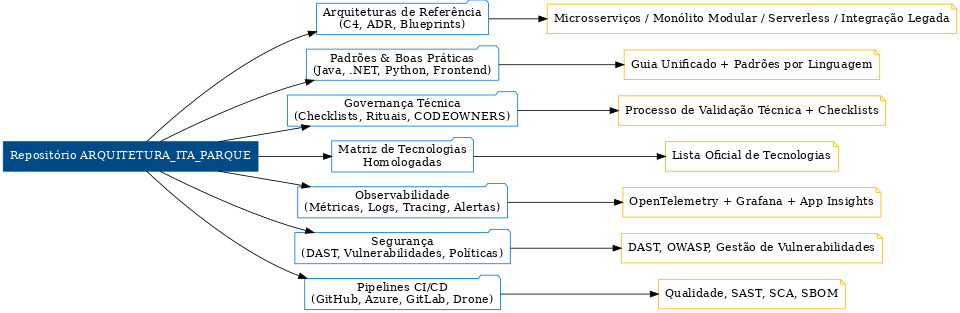

# **ARQUITETURA_ITA_PARQUE**

Repositório institucional para **padronização, governança e referência técnica** da Fábrica de Software.

---

## **📌 Conteúdo Principal**
- **Arquiteturas de Referência**
  - Modelos **C4** (contexto, contêiner, componentes)
  - **ADRs** (Architecture Decision Records)
  - **Blueprints**: microsserviços, monólito modular, serverless, integração legada, eventos assíncronos
- **Guia Unificado de Padrões & Boas Práticas**
  - Java (Spring), .NET Core, Python (FastAPI), Frontend (React)
  - Segurança (DAST, gestão de vulnerabilidades, políticas de acesso)
  - Observabilidade (OTel, métricas, logs, tracing)
  - Testes (pirâmide de testes, Pact, coverage)
- **Matriz de Tecnologias Homologadas**
- **Governança Técnica**
  - Checklists, rituais, processos de validação
  - CODEOWNERS e fluxo de aprovações
- **Pipelines de Qualidade e Automação** (SAST, SCA, SBOM)

---

## **🚀 Como Usar**
1. **Verificar Tecnologias Homologadas**  
   → [`ops/matriz-tecnologias/matriz.md`](ops/matriz-tecnologias/matriz.md)
2. **Selecionar Arquitetura Base**  
   → `reference-architectures/` e escolha o blueprint adequado
3. **Aplicar Padrões Técnicos**  
   → `standards/` conforme linguagem/plataforma
4. **Seguir Fluxo de Governança**  
   → [`governance/processo-validacao-tecnica.md`](governance/processo-validacao-tecnica.md) + checklists

---

## **⚙️ Pipelines Disponíveis**
| Plataforma      | Localização |
|-----------------|-------------|
| **GitHub Actions** | `standards/cicd/github/.github/workflows/quality.yml` |
| **Azure DevOps**   | `standards/cicd/azure/azure-pipelines.yml` |
| **GitLab CI**      | `standards/cicd/gitlab/.gitlab-ci.yml` |
| **Drone CI**       | `standards/cicd/drone/.drone.yml` |

---

## **🏛 Governança e Compliance**
- Revisão trimestral da **matriz de tecnologias**
- **Rituais do comitê técnico** para decisões estratégicas
- **ADRs** para registro de decisões relevantes
- Gestão de segurança com pipelines automáticos e políticas de acesso

---

## **📊 Observabilidade**
- **Métricas**: Prometheus, Grafana, App Insights
- **Tracing**: OpenTelemetry
- **Logs**: Padrões centralizados e correlação entre serviços
- **Alertas**: Configuração para eventos críticos e SLOs

---

## **🔐 Segurança**
- **DAST** (Dynamic Application Security Testing)
- **Gestão de vulnerabilidades** e baseline OWASP
- **Políticas de acesso** e segregação de funções
- **Supply Chain Security** (SBOM, dependabot)

---

## **📂 Estrutura do Repositório**
```

deploy/                  # Deploys Azure / GitOps
docs/                    # Documentos gerais e APIs
governance/              # Governança técnica, checklists, processos
ops/                     # Matriz de tecnologias, migração, monitoring
reference-architectures/ # Arquiteturas de referência (blueprints)
standards/               # Padrões técnicos por linguagem/plataforma
testing/                 # Estratégias e guias de testes
templates/               # Templates de ADR, PR, Issues

```

---

## **📅 Atualizações**
- Revisão contínua
- Mudanças estruturais → **validação do comitê técnico**
- Histórico e versões → [`CHANGELOG.md`](CHANGELOG.md)

---

## **📌 Visão Executiva**

> **Legenda:** Este diagrama consolida **arquitetura, governança, padrões e pipelines** para visão rápida de stakeholders.

---
